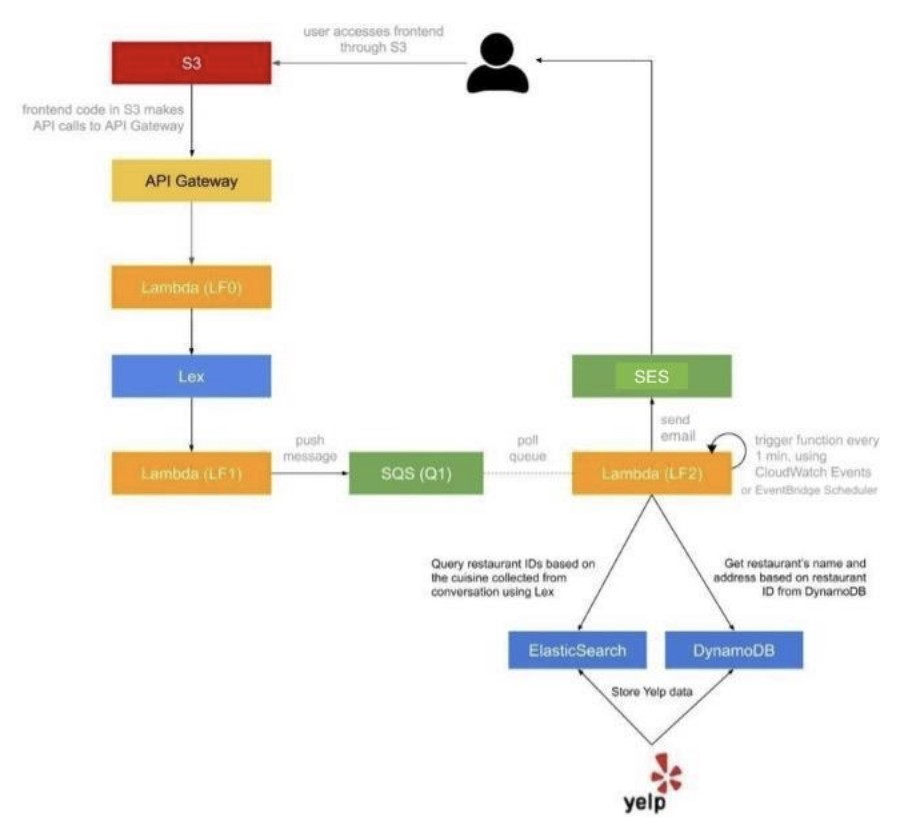
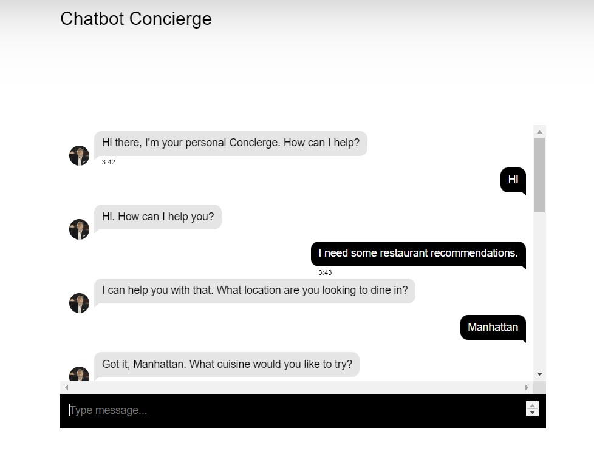
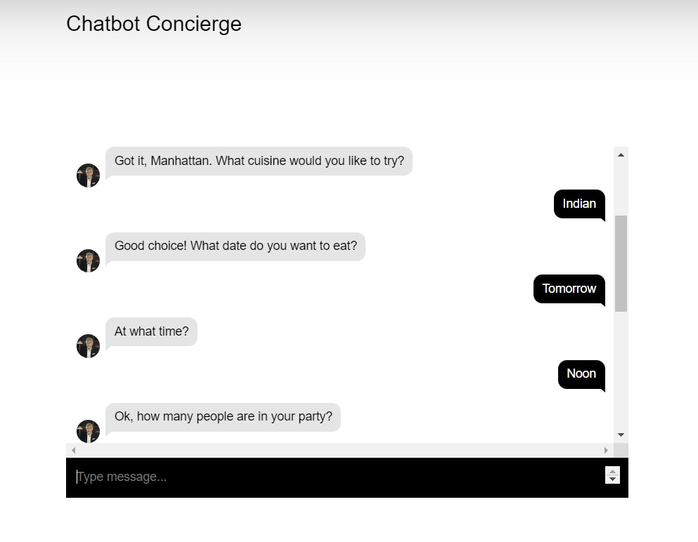
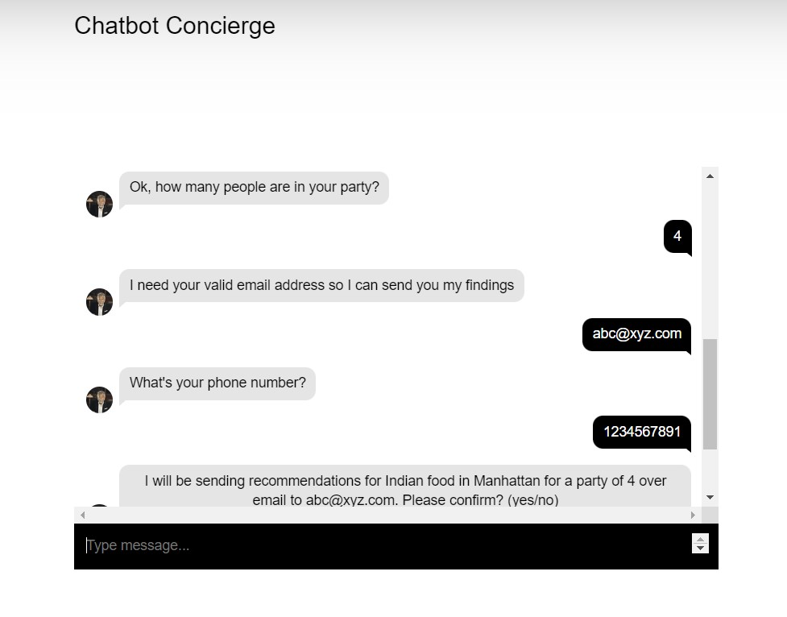
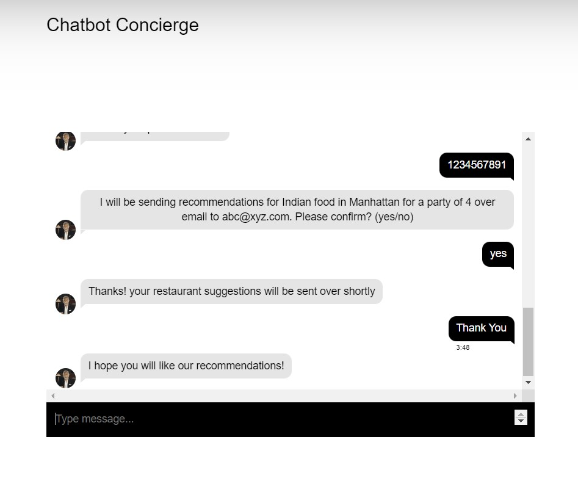
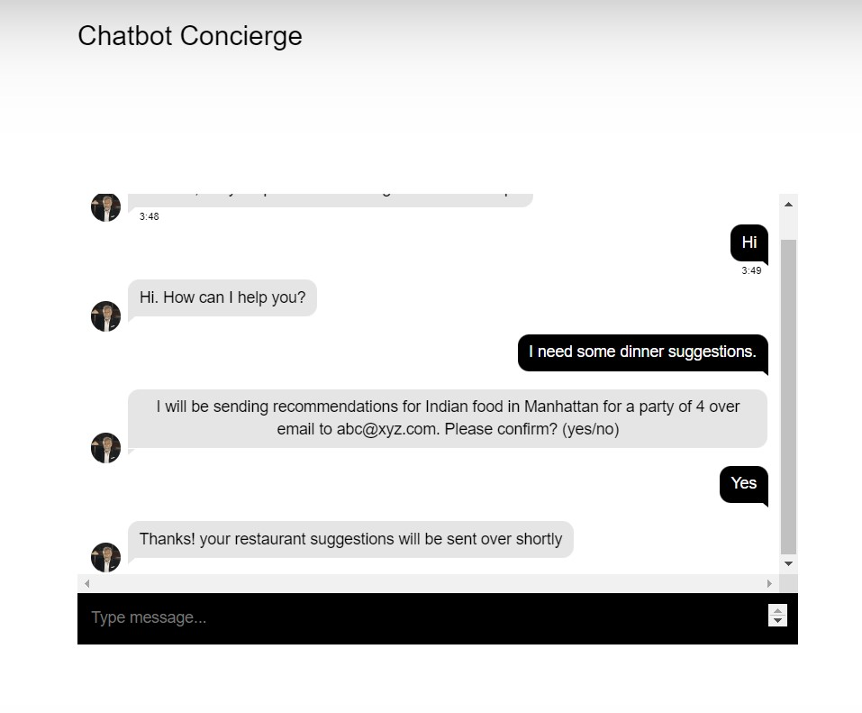
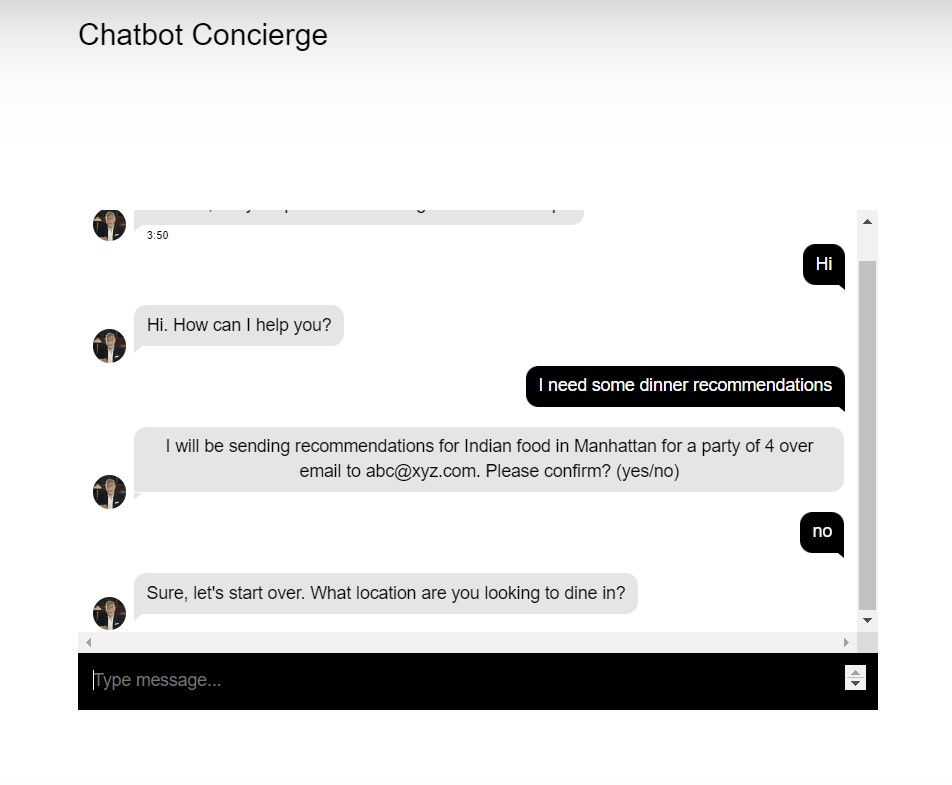

# Dining Concierge Chatbot Project 
**Cloud Computing - CSGY 9223 - NYU Tandon**
* Suriya Prakash Jambunathan (sj3828)
* Vamsi Krishna Bunga (vb2279)

### Welcome to the Dining Concierge Chatbot project
[Link to Bot](https://vb2279cchw1.s3.amazonaws.com/chat.html)

This project seeks to revolutionize the customer service experience by leveraging the power of Natural Language Processing.  
Our goal is to create a responsive chatbot that provides restaurant suggestions tailored to users’ preferences, which are collected through conversational interactions.

## Features:
* Web Interface: Frontend hosted on AWS S3.
* API: Set up via API Gateway with CORS enabled.
* Chatbot: Developed on Amazon Lex, it gathers user preferences such as location, cuisine, and more, pushing data to an SQS queue.
* Lex Integration: Seamlessly integrated into our API using AWS SDK.
* Data Collection: Over 5,000 Manhattan restaurants sourced from Yelp, stored in a DynamoDB table.
* ElasticSearch: Efficient restaurant search capability indexed under “restaurants”.
* Recommendation System: Fetches suggestions from ElasticSearch and DynamoDB, and sends them to users via SES.
  
This project is a comprehensive demonstration of serverless architecture, microservices, and integration of multiple AWS services to enhance the dining experience for users.

## Chatbot Architecure

## Conversation with Dining Suggestions Chatbot

## User returns to chat session in a different browser
### Scenario 1: User accepts previous recommendation

### Scenario 2: User denies previous recommendation

